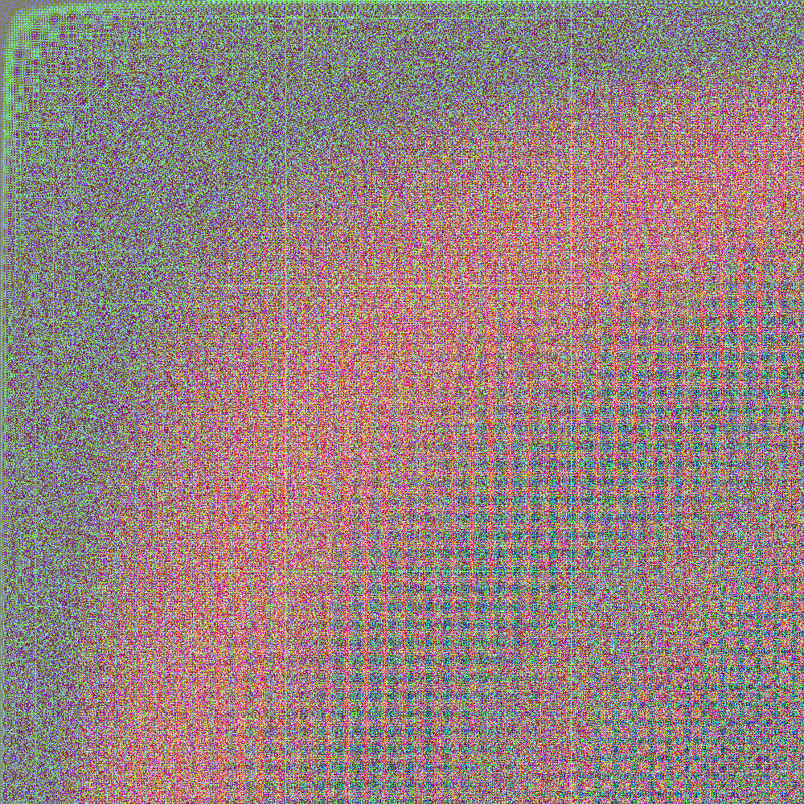

# function-mapper
## *Image manipulation script, utilizing Pillow.*

### *Examples of `fImage` function*

#### Observe function `(lambda x, y: sin(x) * sin(y) * x * y + x)`:

#### As opposed to function `(lambda x, y: x * y + x * sin(x))`:

